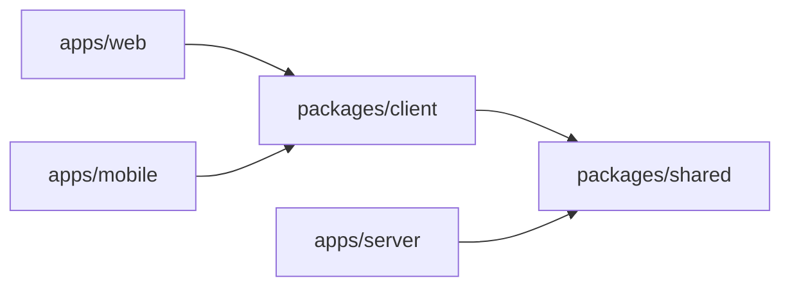

# Todo List

Список задач с регистрацией и входом: REST API, веб-клиент и мобильное приложение в одном монорепозитории.

- **API** — Node.js, Express 5, MongoDB (Mongoose), JWT.
- **Веб** — React 19 + Vite.
- **Мобильное приложение** — Expo (React Native) + Expo Router.

Пользователь регистрируется, входит и работает только со своими задачами: создаёт, редактирует, отмечает выполненными и удаляет их. Без токена список не открывается, чужие задачи недоступны — и в API, и в обоих клиентах.

## Быстрый старт

Нужен только Docker (на Windows — Docker Desktop), настраивать ничего не нужно:

```bash
git clone https://github.com/offsya/todoListSenama.git
```

```bash
cd todoListSenama && docker compose up -d --build
```

Первая сборка занимает несколько минут. Затем откройте http://localhost:8080 — веб-клиент; http://localhost:8082 — мобильное приложение в браузере; http://localhost:4000 — API. Мобильное приложение на телефоне через Expo Go, готовые образы с Docker Hub и команды внутри контейнеров — в разделе [Запуск в Docker](#запуск-в-docker).

## Содержание

- [Стек](#стек)
- [Структура репозитория](#структура-репозитория)
- [Запуск в Docker](#запуск-в-docker)
- [Локальный запуск для разработки](#локальный-запуск-для-разработки)
- [Мобильное приложение](#мобильное-приложение)
- [API](#api)
- [Тесты](#тесты)
- [Как выполнены требования](#как-выполнены-требования)
- [Архитектурные решения](#архитектурные-решения)
- [Безопасность](#безопасность)
- [Скрипты](#скрипты)
- [Переменные окружения](#переменные-окружения)
- [Процесс разработки](#процесс-разработки)
- [Ограничения и что можно улучшить](#ограничения-и-что-можно-улучшить)

## Стек

| Часть         | Технологии                                                                                                                 |
| ------------- | -------------------------------------------------------------------------------------------------------------------------- |
| API           | Node.js 24, Express 5, MongoDB + Mongoose 9, zod 4, jsonwebtoken, scrypt (`node:crypto`), helmet, express-rate-limit, pino |
| Веб           | React 19, Vite 8, React Router 7, TanStack Query 5, react-hook-form                                                        |
| Мобильное     | Expo SDK 57, React Native 0.86, Expo Router, expo-secure-store                                                             |
| Общее         | TypeScript 6, npm workspaces                                                                                               |
| Тесты         | Vitest 5, Supertest, mongodb-memory-server, Testing Library, MSW, jest-expo                                                |
| Качество кода | ESLint 10 (typescript-eslint с проверкой типов, правила React Compiler), Prettier, GitHub Actions                          |

## Структура репозитория

```
apps/
  server/    REST API (Express + MongoDB)
  web/       веб-клиент (React + Vite)
  mobile/    мобильное приложение (Expo)
packages/
  shared/    контракт API: типы, zod-схемы, HTTP-клиент — общий для всех трёх приложений
  client/    общая клиентская логика веба и мобилки: сессия, хуки React Query
```



Одни и те же zod-схемы проверяют запросы на сервере и формы в клиентах, а веб и мобилка используют одинаковые хуки. Приложения отличаются только платформенным UI.

## Запуск в Docker

Нужен только Docker (на Windows — Docker Desktop с WSL 2), настраивать ничего не нужно.

### Готовые образы с Docker Hub

На [Docker Hub](https://hub.docker.com/r/offsya/todolistsenamasoft) опубликованы образы `offsya/todolistsenamasoft:api`, `:web` и `:mobile-web` и описание стека `:compose`, которое связывает их с официальным `mongo:8`. Отдельно лежит `:expo` — dev-сервер Expo для телефона ([ниже](#мобильное-приложение-на-телефоне-expo-go)).

На Windows достаточно дважды кликнуть [`scripts/start-todo.bat`](scripts/start-todo.bat). На любой системе то же самое делает одна команда:

```bash
docker compose -f oci://docker.io/offsya/todolistsenamasoft:compose up -d
```

Docker скачает все образы, поднимет четыре контейнера и откроет порты. Скрипт ещё дождётся готовности и откроет браузер. В Docker Desktop на вкладке **Containers** появится группа `todolistsenamasoft`: её можно развернуть и увидеть каждый контейнер с его образом и портами, а кнопки ▶ и ■ у группы запускают и останавливают всё сразу, данные сохраняются.

Кнопка **Run** в Docker Desktop так не умеет: она всегда запускает один образ. Для неё есть образ «всё в одном» `offsya/todolistsenamasoft` (тег `latest`, подробности [ниже](#образ-всё-в-одном)). Найдите его в поиске, нажмите **Run** и в **Optional settings** впишите Host port `8080` напротив порта `8080` (так же `8082` и `4000`). Без этого шага порты не откроются: образ сам публиковать порты не может.

### Из исходников

В корне репозитория:

```bash
docker compose up -d --build
```

Оба способа занимают одни и те же порты, поэтому одновременно запускайте только один.

| Адрес                 | Что там                                                                         |
| --------------------- | ------------------------------------------------------------------------------- |
| http://localhost:8080 | Веб-клиент                                                                      |
| http://localhost:8082 | Мобильное приложение (веб-сборка Expo)                                          |
| http://localhost:4000 | API через nginx — для мобильного приложения на телефоне или эмуляторе (Expo Go) |

Проверить, что стек поднялся и основные требования выполняются (нужен Node.js; скрипт регистрирует двух тестовых пользователей):

```bash
npm run smoke
```

Контейнеры называются `todoListSenamaSoft-mongo`, `-api`, `-web` и `-mobile-web`, проект Compose — `todolistsenamasoft` (Compose требует нижний регистр).

- Веб и мобильная веб-сборка обращаются к API через встроенный nginx по тому же адресу (`/api`), поэтому CORS не нужен.
- Наружу опубликован только nginx. Сам контейнер API закрыт: лимиты попыток входа доверяют заголовку `X-Forwarded-For` только от nginx, и прямой доступ позволил бы их обойти. Порт 4000 тоже обслуживает nginx.
- MongoDB работает без пароля. В стеке из исходников её порт открыт только на `127.0.0.1` — для `npm run dev` и инструментов вроде Compass, в стеке с Docker Hub не открыт вовсе.
- nginx отдаёт страницы с Content-Security-Policy и запретом встраивания во фреймы. API работает в production-режиме от непривилегированного пользователя.
- Секрет для подписи токенов можно не задавать. При первом запуске API генерирует случайный секрет и хранит его в volume `api-data`, поэтому у каждой установки он свой, а выданные токены переживают перезапуски. Свой `JWT_SECRET` и срок жизни токенов можно задать в `.env` (шаблон — `.env.example`).

Остановить (данные сохранятся в volume): кнопка ■ у группы в Docker Desktop или

```bash
docker compose -p todolistsenamasoft stop
```

### Мобильное приложение на телефоне (Expo Go)

Образ `offsya/todolistsenamasoft:expo` — dev-сервер Expo (Metro) с исходниками мобильного приложения. Телефон с Expo Go сканирует QR-код, получает JS-бандл с порта 8081 компьютера и ходит в API на порт 4000 того же компьютера. Телефон и компьютер должны быть в одной сети, а брандмауэр — пропускать входящие подключения к Docker на портах 8081 и 4000.

Телефону нужен адрес компьютера в локальной сети, а изнутри контейнера его не узнать, поэтому адрес передаётся в переменной `REACT_NATIVE_PACKAGER_HOSTNAME`. На Windows всё делает двойной клик по [`scripts/start-expo.bat`](scripts/start-expo.bat): скрипт сам находит адрес, при необходимости поднимает стек с Docker Hub, скачивает свежий образ и запускает dev-сервер с QR-кодом в окне. Если адрес определился неверно (VPN, несколько сетевых карт), передайте его аргументом: `start-expo.bat 192.168.1.10`.

На любой системе — сначала стек (как выше), затем dev-сервер, подставив свой адрес:

```bash
docker run -it --rm --name todoListSenamaSoft-expo -p 8081:8081 -e REACT_NATIVE_PACKAGER_HOSTNAME=192.168.1.10 offsya/todolistsenamasoft:expo
```

Из исходников то же самое:

```bash
EXPO_HOST=192.168.1.10 docker compose --profile expo up expo
```

В окне работают клавиши Expo: `r` — перезагрузить приложение, `j` — отладчик, `?` — все команды; `Ctrl+C` останавливает сервер. Expo Go должен поддерживать SDK 57.

### Команды внутри контейнеров

Логи всех контейнеров стека или одного:

```bash
docker compose -p todolistsenamasoft logs -f
```

```bash
docker logs -f todoListSenamaSoft-api
```

Оболочка внутри контейнера API (Alpine, `sh`):

```bash
docker exec -it todoListSenamaSoft-api sh
```

База данных в `mongosh` — например, `db.users.find()` или `db.todos.countDocuments()`:

```bash
docker exec -it todoListSenamaSoft-mongo mongosh todo-app
```

Запрос к API с компьютера:

```bash
curl http://localhost:4000/health
```

Тесты, проверка типов и линтер мобильного приложения прямо в образе Expo — исходники и все зависимости уже внутри:

```bash
docker run --rm offsya/todolistsenamasoft:expo npm test
```

```bash
docker run --rm offsya/todolistsenamasoft:expo npm run typecheck
```

```bash
docker run --rm offsya/todolistsenamasoft:expo npm run lint
```

Оболочка в образе Expo — для любых других команд (`npx expo-doctor`, `npx expo export` и т. п.):

```bash
docker run -it --rm offsya/todolistsenamasoft:expo sh
```

### Образ «всё в одном»

Кнопка **Run** в Docker Desktop запускает только один образ, поэтому для неё собирается отдельный образ — цель `all-in-one` того же Dockerfile. Он собран на чистом Ubuntu, из образа MongoDB взят только `mongod` (около 580 МБ вместо 1,4 ГБ). MongoDB, API и nginx работают рядом под `tini` ([`docker/all-in-one/start.sh`](docker/all-in-one/start.sh)) от непривилегированного пользователя, данные лежат в volume, а секрет для токенов генерируется так же, как в стеке выше. В консоль контейнера скрипт пишет короткие шаги запуска и итоговое `Ready`, подробный лог MongoDB уходит в файл. Несколько процессов в одном контейнере — осознанное отступление от правила «один процесс — один контейнер» ради запуска одной кнопкой. CI собирает этот образ и прогоняет по нему тот же smoke-тест.

### Публикация на Docker Hub

Нужен `docker login` с доступом к `offsya`. Образы стека и dev-сервера Expo — из корня репозитория:

```bash
docker compose --profile expo build
```

```bash
docker compose --profile expo push
```

Описание стека, если менялся [`deploy/docker-compose.yml`](deploy/docker-compose.yml) (переменных `${...}` в нём нет намеренно: для опубликованных стеков Compose просит подтвердить каждую):

```bash
cd deploy && docker compose publish offsya/todolistsenamasoft:compose
```

Образ «всё в одном»:

```bash
docker build --target all-in-one -t offsya/todolistsenamasoft .
```

```bash
docker push offsya/todolistsenamasoft
```

## Локальный запуск для разработки

Нужны **Node.js 24** (см. `.nvmrc`; подойдёт и 22.22+) и npm 10+.

```bash
npm install
```

`npm install` также собирает внутренние пакеты и скачивает бинарник MongoDB для тестов и локального запуска.

```bash
cp apps/server/.env.example apps/server/.env
```

Запустите только MongoDB из Docker:

```bash
docker compose up -d mongo
```

…или без Docker, в отдельном терминале (данные хранятся в `apps/server/.mongo-data`):

```bash
npm run db:memory
```

Запустите API и веб-клиент:

```bash
npm run dev
```

- API — http://localhost:4000
- Веб — http://localhost:5173. Dev-сервер Vite проксирует `/api` на API, поэтому CORS для веба локально не нужен.

Для ручной проверки API есть [`apps/server/requests.http`](apps/server/requests.http) (HTTP Client в WebStorm/IDEA или REST Client в VS Code).

## Мобильное приложение

API должен быть запущен (см. выше). Затем:

```bash
npm run dev:mobile
```

- **Телефон** — откройте QR-код в Expo Go; телефон и компьютер должны быть в одной сети. Адрес API приложение берёт с хоста dev-сервера Expo (тот же компьютер, порт 4000). Брандмауэр должен пропускать входящие подключения на порт 4000.
- **Android-эмулятор** — клавиша `a`; **iOS-симулятор** (macOS) — `i`; **браузер** — `w`.
- **Другой адрес API** (`expo start --tunnel`, другая сеть, задеплоенный API) — задайте его в `apps/mobile/.env`:
  ```
  EXPO_PUBLIC_API_URL=http://192.168.1.10:4000
  ```

Expo Go должен поддерживать SDK 57. Иначе соберите dev-сборку: `npx expo run:android`.

Для релизных и preview-сборок `EXPO_PUBLIC_API_URL` обязателен: без него приложение не запустится, вместо того чтобы молча стучаться на `localhost`. Android в релизных сборках блокирует `http://`, поэтому API должен быть доступен по `https://`.

## API

Базовый адрес — `http://localhost:4000`. Защищённые маршруты требуют заголовок `Authorization: Bearer <token>`.

| Метод  | Путь             | Описание                                                | Ответ                 |
| ------ | ---------------- | ------------------------------------------------------- | --------------------- |
| POST   | `/auth/register` | Регистрация: `{ email, password }`                      | `201 { token, user }` |
| POST   | `/auth/login`    | Вход: `{ email, password }`                             | `200 { token, user }` |
| GET    | `/auth/me`       | Текущий пользователь 🔒                                 | `200 { user }`        |
| GET    | `/todos`         | Задачи текущего пользователя, новые сверху 🔒           | `200 Todo[]`          |
| POST   | `/todos`         | Создать задачу: `{ text }` 🔒                           | `201 Todo`            |
| GET    | `/todos/:id`     | Одна задача 🔒                                          | `200 Todo`            |
| PUT    | `/todos/:id`     | Изменить текст и/или статус: `{ text?, completed? }` 🔒 | `200 Todo`            |
| DELETE | `/todos/:id`     | Удалить задачу 🔒                                       | `204`                 |
| GET    | `/health`        | Живость сервиса и соединение с MongoDB                  | `200` / `503`         |

```ts
type Todo = { id: string; text: string; completed: boolean; createdAt: string; updatedAt: string };
type User = { id: string; email: string; createdAt: string };
```

Правила валидации (общие для сервера и клиентов, [`packages/shared/src/schemas`](packages/shared/src/schemas)):

- email обрезается по краям и приводится к нижнему регистру, до 254 символов;
- пароль от 8 до 128 символов;
- текст задачи от 1 до 500 символов после обрезки пробелов;
- неизвестные поля отклоняются, поэтому, например, сменить владельца задачи через API нельзя.

Кроме того, у одного пользователя может быть не больше 1000 задач. `GET /todos` отдаёт список целиком, и без лимита один аккаунт мог бы сделать этот запрос медленным для всего сервера.

Все ошибки возвращаются в одном формате:

```json
{
  "error": {
    "code": "VALIDATION_ERROR",
    "message": "Validation failed",
    "details": [{ "path": "text", "message": "Text must not be empty" }]
  }
}
```

| Статус | `code`                            | Когда                                                                                                            |
| ------ | --------------------------------- | ---------------------------------------------------------------------------------------------------------------- |
| 400    | `VALIDATION_ERROR`, `BAD_REQUEST` | Невалидное тело или id, битый JSON, некорректный запрос                                                          |
| 401    | `UNAUTHORIZED`                    | Нет токена, токен невалиден или истёк, неверный пароль                                                           |
| 404    | `NOT_FOUND`                       | Задачи нет **или она принадлежит другому пользователю**                                                          |
| 409    | `CONFLICT`                        | Email уже зарегистрирован; у пользователя уже 1000 задач                                                         |
| 413    | `PAYLOAD_TOO_LARGE`               | Тело запроса больше 10 КБ                                                                                        |
| 415    | `BAD_REQUEST`                     | Неподдерживаемые `Content-Encoding` или кодировка тела                                                           |
| 429    | `TOO_MANY_REQUESTS`               | Слишком много попыток входа или регистрации с одного IP, слишком много запросов к задачам от одного пользователя |
| 500    | `INTERNAL_ERROR`                  | Непредвиденная ошибка (подробности только в логах)                                                               |

## Тесты

```bash
npm test
```

| Пакет             | Что проверяется                                                                                                          | Тестов |
| ----------------- | ------------------------------------------------------------------------------------------------------------------------ | -----: |
| `apps/server`     | API целиком через Supertest на MongoDB в памяти: авторизация, доступ к чужим задачам, валидация, ошибки, лимиты          |     96 |
| `apps/web`        | Приложение целиком (маршруты, guards, API-клиент, фокус с клавиатуры) с Testing Library и MSW                            |     30 |
| `apps/mobile`     | Компоненты, навигация, регистрация и CRUD на реальных маршрутах Expo Router, холодный старт, истёкший токен (jest-expo)  |     31 |
| `packages/client` | Хранилище сессии, оптимистичные обновления и откаты при параллельных правках, смена аккаунта во время запросов, редактор |     27 |
| `packages/shared` | Схемы валидации и HTTP-клиент                                                                                            |     36 |

Тесты API из третьего этапа задания:

| Требование                       | Где                                                                                                                                                                             |
| -------------------------------- | ------------------------------------------------------------------------------------------------------------------------------------------------------------------------------- |
| Успешный логин                   | [`auth.test.ts`](apps/server/test/auth.test.ts) — `POST /auth/login › returns a valid access token for correct credentials`                                                     |
| Чужая задача недоступна          | [`authorization.test.ts`](apps/server/test/authorization.test.ts) — `access to other users' todos` (чтение, изменение, удаление, список)                                        |
| Невалидные данные                | [`todos.test.ts`](apps/server/test/todos.test.ts), [`auth.test.ts`](apps/server/test/auth.test.ts) — `rejects …`; [`app.test.ts`](apps/server/test/app.test.ts) — битые запросы |
| Без токена список не открывается | [`authorization.test.ts`](apps/server/test/authorization.test.ts) — `requires a token`, просроченный и поддельный токены                                                        |

Каждый тестовый файл API работает в своей базе внутри одного экземпляра mongodb-memory-server, поэтому файлы выполняются параллельно.

## Как выполнены требования

**1. Задачи.** Эндпоинты `GET/POST /todos`, `PUT/DELETE /todos/:id` (плюс `GET /todos/:id`), данные хранятся в MongoDB. В вебе и в мобильном приложении задачи можно создавать, редактировать (двойной клик или карандаш в вебе, тап по тексту в мобилке), отмечать выполненными, удалять и фильтровать.

**2. Пользователи.** `POST /auth/register` и `POST /auth/login` возвращают JWT. Каждая задача хранит владельца, и все запросы к задачам ограничены владельцем из токена. В вебе маршруты закрыты guard'ами, в мобилке — `Stack.Protected`. Истёкший или отозванный токен разлогинивает пользователя автоматически.

**3. Тесты API.** См. [таблицу выше](#тесты). Помимо API, тестами покрыты общие пакеты, веб и мобилка.

## Архитектурные решения

- **Монорепозиторий на npm workspaces.** Внутренние пакеты собираются в ESM (`dist/`), и Node, Vite и Metro потребляют один и тот же JS. Корневые скрипты собирают их в порядке зависимостей, а `test`/`typecheck`/`lint` перед запуском пересобирают пакеты, поэтому никогда не работают с устаревшим `dist`.
- **Контракт в одном месте.** zod-схемы из `@todo/shared` валидируют запросы на сервере и формы в клиентах, так что ограничения не расходятся. Типизированный HTTP-клиент общий для веба и мобилки.
- **Слои сервера:** `router → controller → service → model`. Ответы собираются явными DTO-мапперами, поэтому служебные поля (`owner`, хеш пароля) не утекают. Ошибки обрабатываются в одном месте.
- **`404` вместо `403` для чужой задачи** — по ответу нельзя проверить, существует ли задача с таким id.
- **`PUT` — частичное обновление** (текст и/или статус), как сформулировано в задании.
- **Пароли хешируются scrypt из `node:crypto`** (N=2¹⁵, r=8, p=3 по рекомендации OWASP). Вычисление идёт в пуле потоков libuv и не блокирует event loop. Первая версия использовала bcryptjs — чистый JS в основном потоке, и на ревью замер показал, что 15 параллельных логинов замедляли весь API до ~0,6 с на запрос; со scrypt ответ остаётся ~15 мс.
- **Оптимистичные обновления** (TanStack Query): интерфейс реагирует сразу. При ошибке откатывается только то, что изменил неудачный запрос, а после последней из параллельных мутаций список синхронизируется с сервером. Кеш разделён по пользователям и очищается при смене пользователя.
- **Одна версия React во всём репозитории.** Expo SDK 57 фиксирует React 19.2.3, поэтому веб использует ту же версию. По той же причине веб на React Router 7: v8 требует React ≥ 19.2.7, а две копии React в монорепозитории ломают хуки.
- **Токен на клиентах.** В вебе он лежит в `localStorage`, сессия синхронизируется между вкладками. Это просто и переживает перезагрузку, но токен доступен скриптам на странице — защита держится на отсутствии XSS (React экранирует вывод), а в Docker-образе её дополняет строгая Content-Security-Policy. Альтернатива — httpOnly-cookie, но тогда понадобится защита от CSRF. В мобилке токен хранится в Keychain/Keystore через `expo-secure-store`.

## Безопасность

- JWT HS256: алгоритм зафиксирован при подписи и проверке, `sub` проверяется как ObjectId, срок жизни настраивается (по умолчанию 7 дней).
- На неизвестный email и неверный пароль вход отвечает одинаково и тратит одинаковое время (сравнение с фиктивным хешем), поэтому по входу нельзя узнать, зарегистрирован ли email. Регистрация при этом честно отвечает 409 на занятый email: без подтверждения почты это осознанный компромисс.
- Попытки входа и регистрации ограничены по IP (`AUTH_RATE_LIMIT_MAX`). За прокси нужно задать `TRUST_PROXY`, а сам API не должен быть доступен в обход прокси (в Docker так и сделано).
- Запросы к задачам ограничены по пользователю (`TODOS_RATE_LIMIT_MAX`), а список — 1000 задачами: один аккаунт не может завалить базу записями или раздуть ответ `GET /todos`.
- Строгие схемы отклоняют лишние поля (mass assignment), а Mongoose `sanitizeFilter` даёт дополнительную защиту от NoSQL-инъекций.
- helmet, CORS по allow-list, лимит тела 10 КБ, `WWW-Authenticate` на ответах 401.
- Заголовки и токены не попадают в логи. Текст ошибок 500 не раскрывает внутренности.
- В production API не запустится с примером `JWT_SECRET` из `.env.example`.

## Скрипты

| Команда              | Что делает                                             |
| -------------------- | ------------------------------------------------------ |
| `npm run dev`        | API + веб + пересборка общих пакетов в watch-режиме    |
| `npm run dev:server` | Только API                                             |
| `npm run dev:web`    | Только веб                                             |
| `npm run dev:mobile` | Expo dev-сервер                                        |
| `npm run db:memory`  | Локальная MongoDB без Docker                           |
| `npm test`           | Все тесты                                              |
| `npm run lint`       | ESLint по всему репозиторию                            |
| `npm run typecheck`  | Проверка типов во всех пакетах                         |
| `npm run build`      | Сборка API и веба, Android-бандл мобильного приложения |
| `npm run smoke`      | Проверка запущенного Docker-стека                      |
| `npm run format`     | Prettier                                               |

## Переменные окружения

**API** (`apps/server/.env`, пример — [`.env.example`](apps/server/.env.example)):

| Переменная             | По умолчанию                                  | Назначение                                          |
| ---------------------- | --------------------------------------------- | --------------------------------------------------- |
| `PORT`                 | `4000`                                        | Порт API                                            |
| `MONGODB_URI`          | `mongodb://127.0.0.1:27017/todo-app`          | Строка подключения к MongoDB                        |
| `JWT_SECRET`           | — (обязательна)                               | Секрет подписи токенов, минимум 32 символа          |
| `JWT_EXPIRES_IN`       | `7d`                                          | Срок жизни токена: `15m`, `12h`, `7d`…              |
| `CORS_ORIGIN`          | `http://localhost:5173,http://localhost:8081` | Разрешённые origin браузерных клиентов              |
| `LOG_LEVEL`            | `info`                                        | Уровень логов pino                                  |
| `PASSWORD_HASH_COST`   | `15`                                          | log₂ N для scrypt                                   |
| `AUTH_RATE_LIMIT_MAX`  | `20`                                          | Попыток входа/регистрации с одного IP за 15 минут   |
| `TODOS_RATE_LIMIT_MAX` | `300`                                         | Запросов к `/todos` от одного пользователя в минуту |
| `TRUST_PROXY`          | `0`                                           | Число обратных прокси перед API                     |

**Веб** (`apps/web/.env`): `VITE_API_URL` — адрес API (по умолчанию `/api` через dev-прокси); `API_PROXY_TARGET` — куда проксировать `/api` (по умолчанию `http://localhost:4000`).

**Мобильное** (`apps/mobile/.env`): `EXPO_PUBLIC_API_URL` — адрес API. В разработке по умолчанию берётся хост dev-сервера Expo с портом 4000; для релизных сборок переменная обязательна.

## Процесс разработки

- Работа шла по этапам задания, в feature-ветках с merge-коммитами: `feature/todos-api` → `feature/auth` → `feature/web` → `feature/mobile` → `chore/ci-docs` → `feature/docker` → `fix/review-findings`. Сообщения коммитов следуют Conventional Commits.
- Каждая ветка с кодом (API, веб, мобилка) перед слиянием проходила независимое код-ревью. Найденные проблемы исправлены отдельными коммитами `fix: address review feedback…` с описанием, что и почему изменено. В их числе: блокирующее event loop хеширование паролей, ответы 500 на некорректные запросы, гонки оптимистичных обновлений, утечка нажатия Enter в кнопку редактирования, дубли задач при повторном нажатии return на клавиатуре телефона.
- Перед сдачей весь репозиторий прошёл финальное ревью: [CODE_REVIEW.md](CODE_REVIEW.md) — что и как проверялось, что найдено и как исправлено (ветка `fix/review-findings`).
- CI (GitHub Actions) на Node 22 и 24 проверяет форматирование, линт, типы и тесты, собирает API и веб и проверяет, что Metro собирает Android-бандл мобильного приложения. Отдельная задача собирает Docker-стек, ждёт, пока все контейнеры станут healthy, и прогоняет по нему `npm run smoke`.

## Ограничения и что можно улучшить

- Нет refresh-токенов и отзыва токена на сервере: выход — локальный. По той же причине токен удалённого пользователя открывал бы `/todos` до истечения срока (удаления пользователей в API пока нет). Для веба можно перейти на httpOnly-cookie.
- Нет пагинации: список ограничен 1000 задачами и отдаётся целиком. Если лимит понадобится поднять, нужна курсорная пагинация.
- Счётчики rate limit хранятся в памяти процесса. Для нескольких экземпляров API нужно общее хранилище (Redis).
- E2E-тесты в настоящих браузере и устройстве (Playwright, Maestro).
- Офлайн-режим и очередь изменений в мобильном приложении.
- Интерфейс только на английском, без i18n.
- `npm audit` находит уязвимости в транзитивных зависимостях CLI-инструментов Expo (braces, node-forge, uuid, decode-uri-component). Это инструменты разработки, они не попадают ни в API, ни в собранные приложения; обновить их можно только вместе с SDK.
